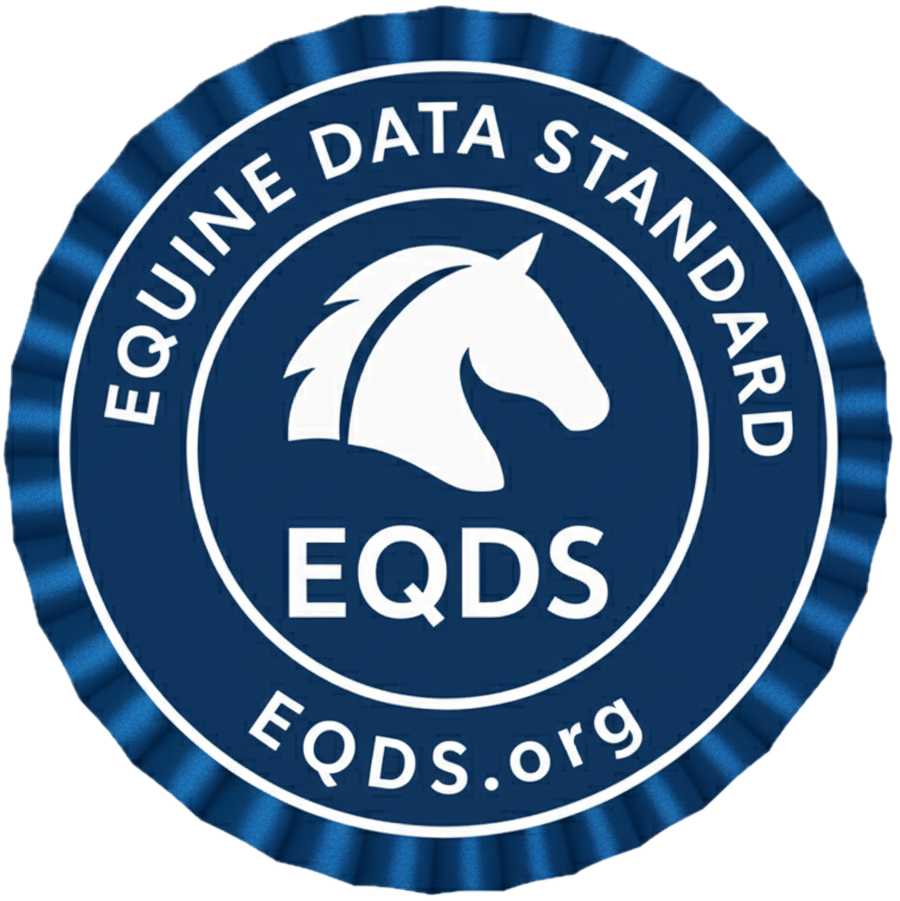

  

    

      
    

  

  <h1 style="border-bottom:none !important">Welcome to <strong>EQDS</strong>, the international open standard for equine data interoperability</h1>

---

## Introduction

The **Equine Data Standard (EQDS)** is a comprehensive FHIR Implementation Guide that defines conformance requirements for systems exchanging equine health information. Built on HL7® FHIR® R5, EQDS extends the base specification to address the unique requirements of equine healthcare, including multi-owner structures, competition records, training data, and breeding information.

EQDS enables **consistent, interoperable data exchange across the equine industry** by providing standardized profiles, value sets, and exchange rules for horse identification, veterinary records, laboratory results, and competition data.

---

## Background

  

    <h3>Equine Healthcare Challenges</h3>
    
The equine industry faces unique data challenges that EQDS addresses:

    <ul>
      <li><strong>Complex ownership structures</strong> with fractional ownership and multiple stakeholders</li>
      <li><strong>Integration of performance and competition data</strong> with health records across disciplines</li>
      <li><strong>Breeding and genetic lineage tracking</strong> for bloodline management and genetic health</li>
      <li><strong>Discipline-specific training and conditioning metrics</strong> tailored to different equestrian sports</li>
      <li><strong>Regulatory requirements</strong> for competition eligibility and interstate movement</li>
    </ul>
  

---

## Built Upon These Standards

  

    <h3>Foundation Standards</h3>
    
EQDS leverages established healthcare and veterinary standards:

    <ul>
      <li><strong>HL7 FHIR R5</strong> - Base specification for healthcare interoperability</li>
      <li><strong>SNOMED CT Veterinary Extension (VetSCT)</strong> - Clinical terminology for veterinary medicine</li>
      <li><strong>AAHA Problem and Diagnosis Terms</strong> - Standardized veterinary diagnoses</li>
      <li><strong>AVMA veterinary informatics standards</strong> - Professional veterinary data standards</li>
      <li><strong>FEI (Fédération Équestre Internationale)</strong> - International competition standards</li>
    </ul>
  

---

## Use Cases

  

    <h3>Primary Use Cases</h3>
    <ul>
      <li><strong>Clinical Care</strong> - Recording and sharing veterinary examinations, treatments, and procedures across practices</li>
      <li><strong>Competition Management</strong> - Tracking fitness-for-competition, drug withdrawal times, and performance records</li>
      <li><strong>Breeding Operations</strong> - Managing reproductive health, genetic testing, and bloodline documentation</li>
      <li><strong>Training Programs</strong> - Documenting training sessions, conditioning programs, and performance metrics</li>
      <li><strong>Regulatory Compliance</strong> - Supporting Coggins testing, health certificates, and movement tracking for shows and sales</li>
    </ul>
  

---

## Who Should Use EQDS

  

    <h3>Veterinary Practices</h3>
    <ul>
      <li>Share patient records seamlessly between practices</li>
      <li>Access comprehensive health histories when treating new patients</li>
      <li>Streamline regulatory reporting and compliance</li>
    </ul>
  

  

    <h3>Horse Owners & Trainers</h3>
    <ul>
      <li>Maintain complete health and performance records</li>
      <li>Share data with veterinarians, trainers, and competition officials</li>
      <li>Track training progress and competition eligibility</li>
    </ul>
  

  

    <h3>Competition Organizations</h3>
    <ul>
      <li>Verify horse eligibility and health status</li>
      <li>Access drug testing and withdrawal time information</li>
      <li>Maintain accurate competition records</li>
    </ul>
  

  

    <h3>Technology Vendors</h3>
    <ul>
      <li>Build interoperable equine management systems</li>
      <li>Integrate with existing veterinary and competition platforms</li>
      <li>Achieve EQDS certification for your products</li>
    </ul>
  

---

## Quick Links

- [**Full Technical Specification**](specification) - Complete FHIR Implementation Guide
- [**Certification Process**](certification) - Vendor compliance and certification *(Coming Soon)*
- [**Certified Vendors**](vendors) - Directory of EQDS-compliant systems *(Coming Soon)*

---

## Call to Action

  

    <h3>Ready to Get Started?</h3>
    
<strong>For Implementers:</strong> Review the <a href="specification">full technical specification</a> to understand FHIR profiles, value sets, and conformance requirements.

    
<strong>For Vendors:</strong> Learn about our certification process to ensure your system meets EQDS compliance standards.

    
<strong>For End Users:</strong> Contact your software vendor to request EQDS support, or explore our directory of certified systems.

  

  

    <h3>Join the Community</h3>
    <ul>
      <li><strong>Email:</strong> equinedatastandard@gmail.com</li>
      <li><strong>Website:</strong> https://eqds.org</li>
      <li><strong>GitHub:</strong> https://github.com/EQDS</li>
    </ul>
    
Pull requests and community contributions are welcome. Help us build the future of equine data interoperability.

  

---

## What EQDS Includes

  

    <h3>Complete FHIR Implementation</h3>
    
EQDS provides a comprehensive FHIR R5 implementation designed specifically for equine healthcare:

    <ul>
      <li><strong>7 Resource Profiles</strong> - Patient, Observation, Medication Administration, Immunization, Procedure, Practitioner, Organization</li>
      <li><strong>6 Code Systems</strong> - Equine sex, breeds, colors, disciplines, competition organizations, medications</li>
      <li><strong>5 Extensions</strong> - Ownership, breeding info, color, withdrawal times, vaccination schedules</li>
      <li><strong>8+ Examples</strong> - Complete implementation samples covering clinical care, competition, and training scenarios</li>
      <li><strong>Value Sets & Search Parameters</strong> - Standardized terminology and query capabilities</li>
    </ul>
    
<strong><a href="specification">→ View complete technical specifications and download all resources</a></strong>

  

